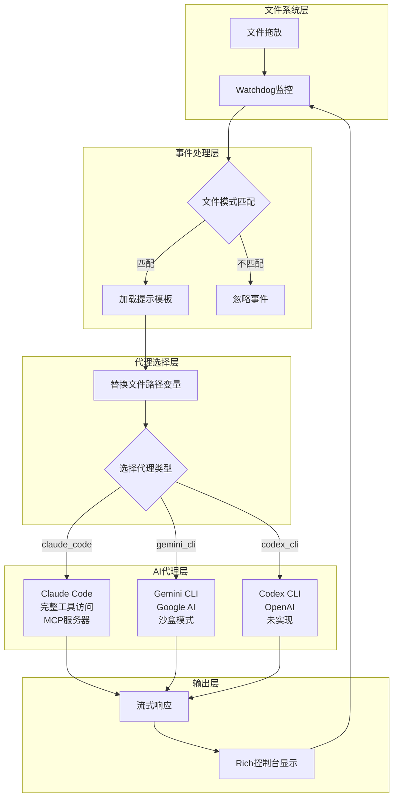
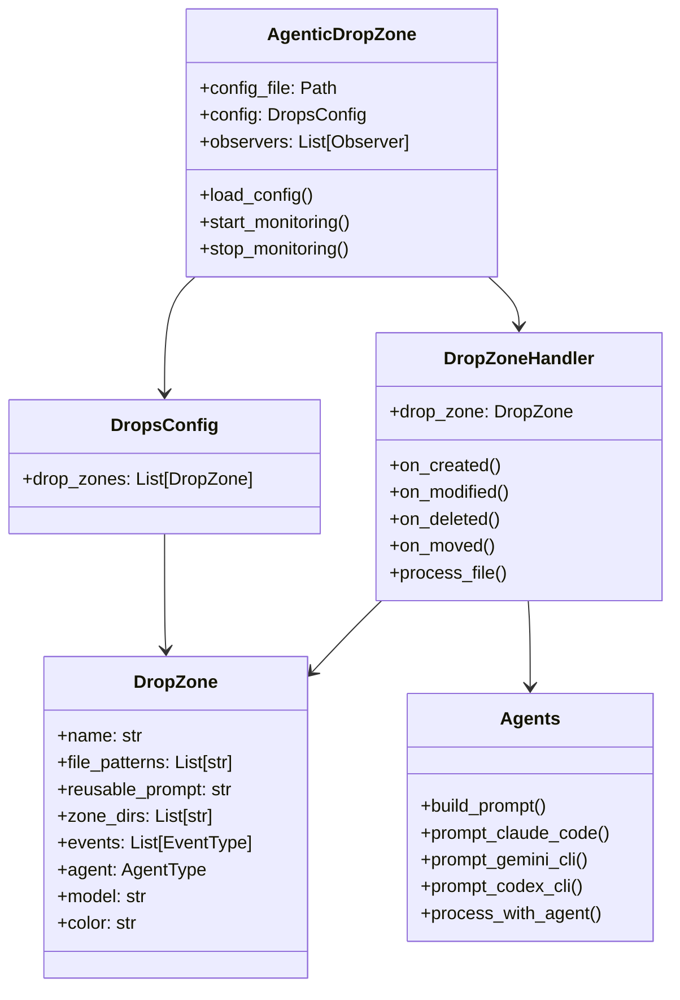
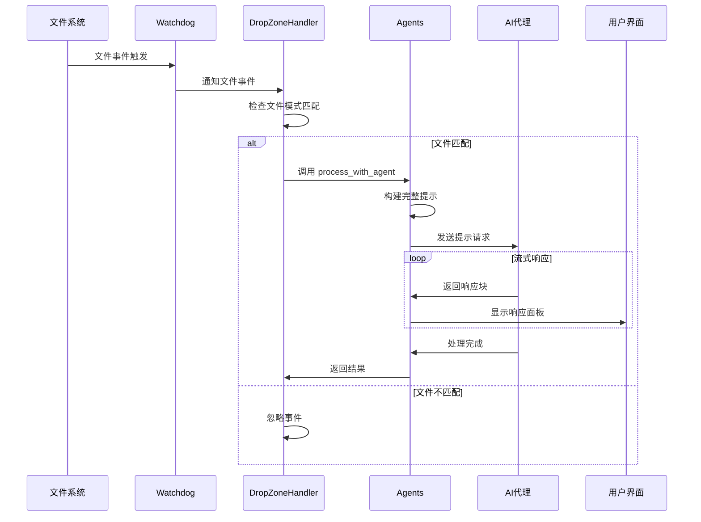
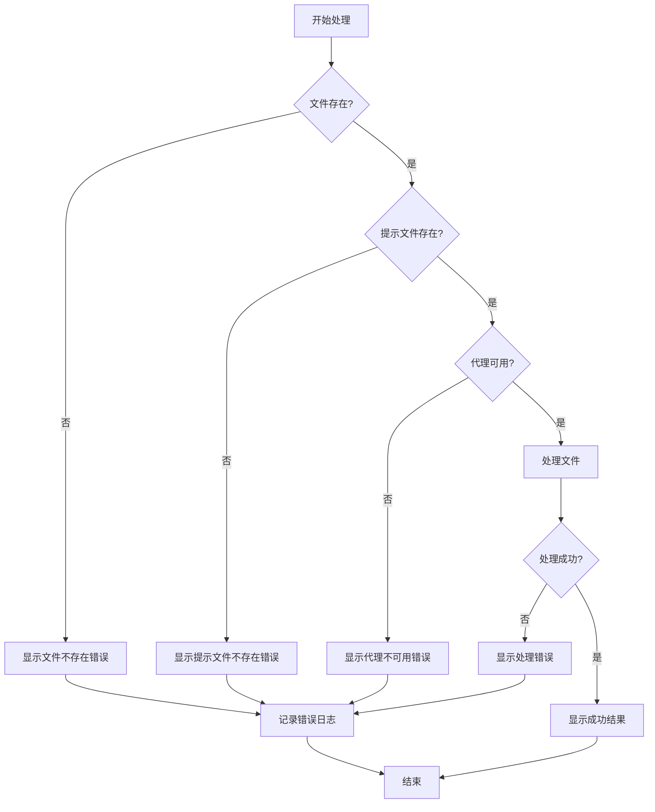

# Agentic Drop Zone - 技术文档

## 目录
- [项目概述](#项目概述)
- [技术栈](#技术栈)
- [系统架构](#系统架构)
- [目录结构](#目录结构)
- [安装和运行指南](#安装和运行指南)
- [核心功能模块](#核心功能模块)
- [数据流程](#数据流程)
- [配置文件说明](#配置文件说明)
- [开发指南](#开发指南)
- [常见问题](#常见问题)

## 项目概述

Agentic Drop Zone 是一个自动化文件处理系统，它监控指定目录并在文件被拖放时触发AI代理（Claude Code、Gemini CLI、Codex CLI）进行处理。这是一个基于事件驱动的智能文件处理工作流系统。

### 核心功能
- 📝 **单文件脚本**：整个系统封装在 `sfs_agentic_drop_zone.py` 中
- ⚙️ **可配置的投放区**：通过 `drops.yaml` 配置多个监控区域
- 🤖 **多代理支持**：支持 Claude Code、Gemini CLI、Codex CLI
- 🧩 **并行处理**：可同时运行多个代理
- 🚀 **任意工作流**：执行代理能够完成的任何任务

### 应用场景
- 图像生成和编辑
- 数据分析和处理
- 音频转录和分析
- 财务数据分类
- 训练数据生成

## 技术栈

### 核心技术
- **Python 3.11+**：主要编程语言
- **asyncio**：异步编程支持
- **Watchdog**：文件系统事件监控
- **Rich**：终端界面美化
- **Pydantic**：数据验证和序列化
- **PyYAML**：配置文件解析

### AI代理集成
- **Claude Code SDK**：Anthropic Claude 集成
- **Gemini CLI**：Google Gemini 命令行工具
- **Codex CLI**：OpenAI Codex（未实现）

### 依赖管理
- **uv**：现代Python包管理器
- **python-dotenv**：环境变量管理

## 系统架构

### 整体架构图



### 组件关系图



## 目录结构

```
agentic-drop-zones/
├── sfs_agentic_drop_zone.py      # 主程序文件
├── drops.yaml                     # 配置文件
├── README.md                      # 项目说明
├── .claude/                       # Claude 命令模板
│   └── commands/
│       ├── echo.md               # 回显命令模板
│       ├── create_image.md       # 图像生成模板
│       ├── edit_image.md         # 图像编辑模板
│       ├── morning_debrief.md    # 晨会总结模板
│       ├── more_training_data.md # 训练数据生成模板
│       └── finance_categorizer.md # 财务分类模板
├── ai_docs/                       # AI文档
│   ├── claude-code-python-sdk.md
│   ├── astral-uv-single-file-scripts.md
│   └── watch-dog-python-docs.md
├── specs/                         # 技术规范
│   └── simple_multi_processing_solution.md
├── example_input_files/           # 示例输入文件
├── edit_image_input_files/        # 图像编辑输入文件
└── images/                        # 项目图片
    └── arch.png                   # 架构图
```

### 运行时目录结构
```
agentic_drop_zone/                 # 运行时创建的监控目录
├── echo_zone/                     # 回显测试区
├── generate_images_zone/          # 图像生成区
├── edit_images_zone/              # 图像编辑区
├── training_data_zone/            # 训练数据生成区
├── morning_debrief_zone/          # 晨会总结区
└── finance_zone/                  # 财务分析区
```

## 安装和运行指南

### 环境要求
- **Python**: 3.11 或更高版本
- **操作系统**: macOS, Linux, Windows
- **内存**: 至少 4GB RAM
- **磁盘空间**: 至少 1GB 可用空间

### 依赖安装

#### 1. 安装 uv 包管理器
```bash
# macOS/Linux
curl -LsSf https://astral.sh/uv/install.sh | sh

# Windows (PowerShell)
powershell -c "irm https://astral.sh/uv/install.ps1 | iex"
```

#### 2. 设置环境变量
创建 `.env` 文件或设置系统环境变量：

```bash
# 必需的环境变量
export ANTHROPIC_API_KEY="your-claude-api-key"

# 可选的环境变量
export CLAUDE_CODE_PATH="/path/to/claude"  # 默认为 "claude"
export GEMINI_CLI_PATH="/path/to/gemini"  # 默认为 "gemini"
export REPLICATE_API_TOKEN="your-replicate-token"  # 图像生成需要
```

#### 3. 安装额外工具（可选）
```bash
# 安装 Whisper（用于音频转录）
uv tool install openai-whisper

# 安装 Claude CLI
npm install -g @anthropic-ai/claude-cli

# 安装 Gemini CLI
npm install -g @google/generative-ai-cli
```

### 启动步骤

#### 1. 克隆项目
```bash
git clone https://github.com/your-repo/agentic-drop-zones.git
cd agentic-drop-zones
```

#### 2. 运行系统
```bash
# 使用 uv 运行（推荐）
uv run sfs_agentic_drop_zone.py

# 或者直接运行
python sfs_agentic_drop_zone.py
```

#### 3. 测试系统
```bash
# 复制测试文件到监控目录
cp example_input_files/echo.txt agentic_drop_zone/echo_zone/
```

### 验证安装
系统启动后应该看到类似输出：
```
✅ All required environment variables are set
✅ Started monitoring drop zone: Echo Drop Zone
   📂 Path: /path/to/agentic_drop_zone/echo_zone
   - Patterns: ['*.txt']
   - Events: ['created', 'modified']
```

## 核心功能模块

### 1. 文件监控模块 (DropZoneHandler)

**功能**：监控指定目录的文件系统事件

**核心类**：`DropZoneHandler`

**支持的事件类型**：
- `created`: 文件创建
- `modified`: 文件修改  
- `deleted`: 文件删除
- `moved`: 文件移动

**工作原理**：
1. 继承 `FileSystemEventHandler`
2. 重写事件处理方法
3. 根据配置的文件模式过滤事件
4. 触发文件处理流程

### 2. 代理管理模块 (Agents)

**功能**：管理和调用不同的AI代理

**支持的代理**：
- **Claude Code**: 功能最强大，支持完整工具访问和MCP服务器
- **Gemini CLI**: 通过命令行调用，支持沙盒模式
- **Codex CLI**: 计划支持（未实现）

**核心方法**：
```python
# 构建提示
build_prompt(prompt_file: str, file_path: str) -> str

# Claude Code 处理
async prompt_claude_code(args: PromptArgs) -> None

# Gemini CLI 处理  
async prompt_gemini_cli(args: PromptArgs) -> None
```

### 3. 配置管理模块

**功能**：解析和验证配置文件

**核心类**：
- `DropsConfig`: 根配置类
- `DropZone`: 单个投放区配置
- `PromptArgs`: 提示参数

**配置验证**：
- 文件路径存在性检查
- 事件类型有效性验证
- 代理类型支持检查

### 4. 用户界面模块

**功能**：提供美观的终端界面

**使用的库**：Rich

**特性**：
- 彩色输出
- 面板显示
- 流式响应展示
- 进度指示

## 数据流程

### 完整数据流程图



### 提示处理流程

1. **文件检测**：Watchdog 检测到文件事件
2. **模式匹配**：检查文件是否匹配配置的模式
3. **提示构建**：读取提示模板，替换 `[[FILE_PATH]]` 变量
4. **代理选择**：根据配置选择对应的AI代理
5. **请求发送**：将构建的提示发送给AI代理
6. **流式响应**：实时显示AI代理的响应
7. **结果展示**：在终端中美观地展示处理结果

### 错误处理流程



## 配置文件说明

### drops.yaml 配置结构

`drops.yaml` 是系统的核心配置文件，定义了所有的投放区域和处理规则。

#### 基本配置示例

```yaml
drop_zones:
  - name: "Echo Drop Zone"                    # 投放区名称
    file_patterns: ["*.txt"]                  # 监控的文件模式
    reusable_prompt: ".claude/commands/echo.md"  # 提示模板路径
    zone_dirs: ["agentic_drop_zone/echo_zone"]   # 监控目录
    events: ["created", "modified"]           # 触发事件类型
    agent: "claude_code"                      # 使用的代理
    model: "sonnet"                          # AI模型
    color: "cyan"                            # 终端显示颜色
    create_zone_dir_if_not_exists: true      # 自动创建目录
```

#### 配置参数详解

| 参数 | 类型 | 必需 | 说明 | 示例值 |
|------|------|------|------|--------|
| `name` | string | ✅ | 投放区显示名称 | "Image Generation Zone" |
| `file_patterns` | array | ✅ | 文件匹配模式，支持通配符 | ["*.txt", "*.md", "*.json"] |
| `reusable_prompt` | string | ✅ | 提示模板文件路径 | ".claude/commands/create_image.md" |
| `zone_dirs` | array | ✅ | 监控目录列表，支持通配符 | ["zone1", "zone2/*"] |
| `events` | array | ❌ | 触发事件类型 | ["created", "modified"] |
| `agent` | string | ❌ | AI代理类型 | "claude_code", "gemini_cli" |
| `model` | string | ❌ | AI模型名称 | "sonnet", "gemini-2.5-pro" |
| `color` | string | ❌ | 终端显示颜色 | "red", "blue", "green" |
| `mcp_server_file` | string | ❌ | MCP服务器配置文件 | ".mcp.json" |
| `create_zone_dir_if_not_exists` | boolean | ❌ | 自动创建不存在的目录 | true, false |

#### 高级配置示例

```yaml
drop_zones:
  # 图像生成投放区
  - name: "Image Generation Drop Zone"
    file_patterns: ["*.txt", "*.md"]
    reusable_prompt: ".claude/commands/create_image.md"
    zone_dirs: ["agentic_drop_zone/generate_images_zone"]
    events: ["created"]
    agent: "claude_code"
    model: "sonnet"
    color: "blue"
    mcp_server_file: ".mcp.json"              # 启用MCP工具
    create_zone_dir_if_not_exists: true

  # Gemini代理示例
  - name: "Gemini Processing Zone"
    file_patterns: ["*.csv", "*.json"]
    reusable_prompt: ".claude/commands/data_analysis.md"
    zone_dirs: ["agentic_drop_zone/gemini_zone"]
    events: ["created", "modified"]
    agent: "gemini_cli"
    model: "gemini-2.5-pro"
    color: "green"
    create_zone_dir_if_not_exists: true
```

### 提示模板文件

提示模板文件使用Markdown格式，支持变量替换。

#### 模板结构

```markdown
---
name: 命令名称
allowed-tools: 允许使用的工具列表
description: 命令描述
---

# 命令标题

命令的详细描述和说明。

## Variables

DROPPED_FILE_PATH: [[FILE_PATH]]
OUTPUT_DIR: path/to/output/

## Workflow

1. 第一步操作
2. 第二步操作
3. 第三步操作

## Example Output Format

期望的输出格式示例
```

#### 变量系统

- `[[FILE_PATH]]`：会被自动替换为实际的文件路径
- 其他变量需要在模板中手动定义

#### 示例模板分析

**Echo命令模板** (`.claude/commands/echo.md`):
```markdown
# Echo Command

Echo the contents of the file at DROPPED_FILE_PATH and provide a brief summary.

## Variables
DROPPED_FILE_PATH: [[FILE_PATH]]
DROPPED_FILE_PATH_ARCHIVE: agentic_drop_zone/echo_zone/drop_zone_file_archive/

## Workflow
1. Read the file contents at DROPPED_FILE_PATH
2. Write out the file in between a markdown code block
3. Below log the total number of characters in the file and the file name
4. Move the file to the archive: `mv DROPPED_FILE_PATH DROPPED_FILE_PATH_ARCHIVE/`
```

### 环境变量配置

#### 必需的环境变量

```bash
# Claude Code API密钥（必需）
ANTHROPIC_API_KEY="sk-ant-api03-..."

# Claude CLI路径（可选，默认为"claude"）
CLAUDE_CODE_PATH="/usr/local/bin/claude"
```

#### 可选的环境变量

```bash
# Gemini CLI路径
GEMINI_CLI_PATH="/usr/local/bin/gemini"

# Replicate API令牌（图像生成需要）
REPLICATE_API_TOKEN="r8_..."

# OpenAI API密钥（Codex CLI需要，未实现）
OPENAI_API_KEY="sk-..."
```

#### .env 文件示例

```bash
# .env 文件
ANTHROPIC_API_KEY=sk-ant-api03-your-key-here
CLAUDE_CODE_PATH=/opt/homebrew/bin/claude
GEMINI_CLI_PATH=/opt/homebrew/bin/gemini
REPLICATE_API_TOKEN=r8_your-token-here
```

### MCP服务器配置

MCP (Model Context Protocol) 服务器为AI代理提供额外的工具和功能。

#### .mcp.json 配置示例

```json
{
  "mcpServers": {
    "replicate": {
      "command": "npx",
      "args": ["-y", "@modelcontextprotocol/server-replicate"],
      "env": {
        "REPLICATE_API_TOKEN": "your-replicate-token"
      }
    },
    "filesystem": {
      "command": "npx",
      "args": ["-y", "@modelcontextprotocol/server-filesystem", "/path/to/allowed/directory"]
    }
  }
}
```

## 开发指南和最佳实践

### 代码结构最佳实践

#### 1. 单文件脚本设计

项目采用单文件脚本设计，所有核心功能都在 `sfs_agentic_drop_zone.py` 中：

**优点**：
- 部署简单，只需一个文件
- 依赖管理通过uv内联声明
- 易于理解和维护

**设计原则**：
- 使用类来组织相关功能
- 通过Pydantic进行数据验证
- 异步编程支持并发处理

#### 2. 配置驱动开发

系统通过 `drops.yaml` 配置文件驱动，支持：
- 多投放区配置
- 灵活的文件模式匹配
- 可插拔的代理系统

#### 3. 错误处理策略

```python
# 示例：优雅的错误处理
try:
    await Agents.process_with_agent(self.drop_zone.agent, prompt_args)
except Exception as e:
    console.print(f"[bold red]❌ Agent processing failed: {e}[/bold red]")
    logger.error(f"Processing failed for {file_path}: {e}")
```

### 添加新的投放区

#### 步骤1：创建提示模板

在 `.claude/commands/` 目录下创建新的Markdown模板：

```markdown
---
name: My Custom Command
allowed-tools: Bash, Read, Write
description: Custom processing command
---

# My Custom Command

## Variables
DROPPED_FILE_PATH: [[FILE_PATH]]
OUTPUT_DIR: agentic_drop_zone/my_zone/output/

## Workflow
1. Read the input file
2. Process the content
3. Save results to OUTPUT_DIR
```

#### 步骤2：更新配置文件

在 `drops.yaml` 中添加新的投放区：

```yaml
drop_zones:
  - name: "My Custom Zone"
    file_patterns: ["*.txt", "*.md"]
    reusable_prompt: ".claude/commands/my_custom_command.md"
    zone_dirs: ["agentic_drop_zone/my_zone"]
    events: ["created"]
    agent: "claude_code"
    model: "sonnet"
    color: "purple"
    create_zone_dir_if_not_exists: true
```

#### 步骤3：测试新投放区

```bash
# 重启系统
uv run sfs_agentic_drop_zone.py

# 测试文件投放
echo "Test content" > test.txt
cp test.txt agentic_drop_zone/my_zone/
```

### 添加新的AI代理

#### 步骤1：扩展AgentType枚举

```python
class AgentType(str, Enum):
    CLAUDE_CODE = "claude_code"
    GEMINI_CLI = "gemini_cli"
    CODEX_CLI = "codex_cli"
    MY_AGENT = "my_agent"  # 新增
```

#### 步骤2：实现代理方法

```python
@staticmethod
async def prompt_my_agent(args: PromptArgs) -> None:
    """Process a file using My Agent."""
    full_prompt = Agents.build_prompt(args.reusable_prompt, args.file_path)

    # 实现你的代理调用逻辑
    # ...

    console.print(
        Panel(
            Text("Processing completed"),
            title="[bold green]🤖 My Agent[/bold green]",
            border_style="green"
        )
    )
```

#### 步骤3：更新路由逻辑

```python
@staticmethod
async def process_with_agent(agent: AgentType, args: PromptArgs) -> None:
    """Route to appropriate agent based on type."""
    try:
        if agent == AgentType.CLAUDE_CODE:
            await Agents.prompt_claude_code(args)
        elif agent == AgentType.GEMINI_CLI:
            await Agents.prompt_gemini_cli(args)
        elif agent == AgentType.MY_AGENT:
            await Agents.prompt_my_agent(args)  # 新增
        # ...
```

### 性能优化建议

#### 1. 文件监控优化

- 使用非递归监控减少系统负载
- 合理设置文件模式，避免监控不必要的文件
- 考虑添加文件大小限制

#### 2. 并发处理优化

当前系统是同步处理，可以考虑实现异步队列：

```python
# 未来改进：异步处理队列
class ProcessingQueue:
    def __init__(self, max_workers=3):
        self.queue = asyncio.Queue()
        self.workers = []
        self.max_workers = max_workers

    async def add_task(self, task):
        await self.queue.put(task)

    async def worker(self):
        while True:
            task = await self.queue.get()
            try:
                await self.process_task(task)
            finally:
                self.queue.task_done()
```

#### 3. 内存管理

- 大文件处理时使用流式读取
- 及时清理临时文件
- 监控内存使用情况

### 调试和日志

#### 启用详细日志

```python
# 修改日志级别
logging.basicConfig(
    level=logging.DEBUG,  # 改为DEBUG
    format="%(asctime)s - %(name)s - %(levelname)s - %(message)s"
)
```

#### 添加自定义日志

```python
logger.info(f"Processing file: {file_path}")
logger.debug(f"Using prompt template: {prompt_template}")
logger.error(f"Failed to process: {error}")
```

#### 调试技巧

1. **文件事件调试**：
```python
def on_created(self, event: FileSystemEvent) -> None:
    print(f"DEBUG: File created - {event.src_path}")
    print(f"DEBUG: Is directory - {event.is_directory}")
    print(f"DEBUG: Should process - {self._should_process_event(EVENT_TYPE_CREATED)}")
```

2. **提示构建调试**：
```python
full_prompt = Agents.build_prompt(args.reusable_prompt, args.file_path)
print(f"DEBUG: Generated prompt:\n{full_prompt}")
```

3. **代理响应调试**：
```python
async for message in client.receive_response():
    print(f"DEBUG: Received message type: {type(message)}")
    if hasattr(message, "content"):
        print(f"DEBUG: Content blocks: {len(message.content)}")
```

## 常见问题和故障排除

### 安装和环境问题

#### Q1: uv 命令未找到
**问题**：运行 `uv run` 时提示命令未找到

**解决方案**：
```bash
# 重新安装 uv
curl -LsSf https://astral.sh/uv/install.sh | sh

# 重新加载shell配置
source ~/.bashrc  # 或 ~/.zshrc

# 验证安装
uv --version
```

#### Q2: Python版本不兼容
**问题**：提示需要Python 3.11+

**解决方案**：
```bash
# 使用uv安装指定Python版本
uv python install 3.11

# 或使用系统包管理器
# macOS
brew install python@3.11

# Ubuntu
sudo apt install python3.11
```

#### Q3: 环境变量未设置
**问题**：提示 `ANTHROPIC_API_KEY` 未设置

**解决方案**：
```bash
# 临时设置
export ANTHROPIC_API_KEY="your-key-here"

# 永久设置（添加到 ~/.bashrc 或 ~/.zshrc）
echo 'export ANTHROPIC_API_KEY="your-key-here"' >> ~/.bashrc

# 或创建 .env 文件
echo 'ANTHROPIC_API_KEY=your-key-here' > .env
```

### 运行时问题

#### Q4: 文件事件未触发
**问题**：拖放文件后没有反应

**排查步骤**：
1. 检查文件是否在正确的目录
2. 验证文件模式是否匹配
3. 确认事件类型配置正确

**调试方法**：
```bash
# 启用详细日志
export PYTHONPATH=.
python -c "
import logging
logging.basicConfig(level=logging.DEBUG)
exec(open('sfs_agentic_drop_zone.py').read())
"
```

#### Q5: 代理调用失败
**问题**：AI代理返回错误或无响应

**常见原因和解决方案**：

1. **API密钥问题**：
```bash
# 验证API密钥
curl -H "Authorization: Bearer $ANTHROPIC_API_KEY" \
     https://api.anthropic.com/v1/messages
```

2. **网络连接问题**：
```bash
# 测试网络连接
ping api.anthropic.com
```

3. **模型名称错误**：
```yaml
# 确保使用正确的模型名称
model: "sonnet"  # 不是 "claude-3-sonnet"
```

#### Q6: 提示模板未找到
**问题**：提示 "Prompt template not found"

**解决方案**：
```bash
# 检查文件是否存在
ls -la .claude/commands/

# 验证路径配置
grep -n "reusable_prompt" drops.yaml

# 创建缺失的模板文件
mkdir -p .claude/commands
touch .claude/commands/missing_template.md
```

### 配置问题

#### Q7: YAML配置解析错误
**问题**：配置文件格式错误

**常见错误**：
```yaml
# 错误：缩进不一致
drop_zones:
- name: "Test Zone"
  file_patterns: ["*.txt"]
   reusable_prompt: "test.md"  # 缩进错误

# 正确：统一缩进
drop_zones:
  - name: "Test Zone"
    file_patterns: ["*.txt"]
    reusable_prompt: "test.md"
```

**验证工具**：
```bash
# 使用Python验证YAML
python -c "import yaml; print(yaml.safe_load(open('drops.yaml')))"
```

#### Q8: 目录权限问题
**问题**：无法创建监控目录

**解决方案**：
```bash
# 检查目录权限
ls -la agentic_drop_zone/

# 修复权限
chmod 755 agentic_drop_zone/
chmod 755 agentic_drop_zone/*/

# 或重新创建目录
rm -rf agentic_drop_zone/
mkdir -p agentic_drop_zone/echo_zone
```

### 性能问题

#### Q9: 系统响应缓慢
**问题**：文件处理速度慢

**优化建议**：
1. 减少监控的文件类型
2. 使用更快的AI模型（如haiku）
3. 限制并发处理数量

```yaml
# 使用更快的模型
model: "haiku"  # 而不是 "sonnet"

# 限制文件模式
file_patterns: ["*.txt"]  # 而不是 ["*"]
```

#### Q10: 内存使用过高
**问题**：系统内存占用过多

**解决方案**：
1. 处理大文件时使用流式读取
2. 及时清理临时文件
3. 重启系统释放内存

```bash
# 监控内存使用
top -p $(pgrep -f sfs_agentic_drop_zone.py)

# 重启系统
pkill -f sfs_agentic_drop_zone.py
uv run sfs_agentic_drop_zone.py
```

### 开发和扩展问题

#### Q11: 添加新代理失败
**问题**：自定义代理无法正常工作

**检查清单**：
- [ ] 在 `AgentType` 枚举中添加新类型
- [ ] 实现对应的处理方法
- [ ] 更新路由逻辑
- [ ] 测试代理可用性

#### Q12: MCP服务器配置问题
**问题**：MCP工具无法使用

**解决方案**：
```bash
# 检查MCP配置文件
cat .mcp.json

# 验证MCP服务器可用性
npx @modelcontextprotocol/server-replicate --help

# 测试环境变量
echo $REPLICATE_API_TOKEN
```

### 获取帮助

#### 官方资源
- [Claude Code SDK文档](https://docs.anthropic.com/en/docs/claude-code/sdk/sdk-overview)
- [Gemini CLI文档](https://github.com/google-gemini/gemini-cli)
- [Watchdog文档](https://python-watchdog.readthedocs.io/)

#### 社区支持
- [GitHub Issues](https://github.com/your-repo/agentic-drop-zones/issues)
- [IndyDevDan YouTube频道](https://www.youtube.com/@indydevdan)

#### 学习资源
- [AI编程原则](https://agenticengineer.com/principled-ai-coding?y=adrzone)
- [Python异步编程教程](https://docs.python.org/3/library/asyncio.html)
- [Rich库文档](https://rich.readthedocs.io/)

---

## 总结

Agentic Drop Zone 是一个强大而灵活的文件处理自动化系统。通过本文档，您应该能够：

1. **理解系统架构**：掌握各组件的作用和交互方式
2. **成功安装和运行**：按照步骤指南完成环境搭建
3. **配置和定制**：根据需求创建自定义投放区和工作流
4. **解决常见问题**：快速诊断和修复运行中的问题
5. **扩展系统功能**：添加新的代理和处理逻辑

这个系统的设计理念是简单而强大，通过配置文件驱动的方式，让用户能够轻松创建复杂的AI驱动工作流。随着AI技术的发展，这个系统也会持续演进，支持更多的代理和功能。

希望这份文档能够帮助您快速上手并充分利用 Agentic Drop Zone 的强大功能！
```
